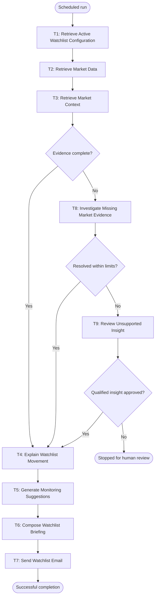

# Workflow of Tasks

## 1. Workflow Overview

### 1.1 Workflow Goal

This workflow supports the StockBrief goal in the completed [team charter](https://github.com/mbuddhal/BUS4498_Team_Build/blob/main/README.md#team-charter). For busy student investors, StockBrief keeps users informed about stocks on their watchlists with minimal daily effort by producing a short, source-backed market update, explaining possible drivers of price movement, and suggesting neutral topics to monitor without providing personalized financial advice or making trades.

**Prerequisite outside this scheduled workflow:** Before a user can receive a briefing, the user manually enters stock symbols, a recipient email, and a market-open or market-close schedule in StockBrief. StockBrief validates those entries and saves them in its Watchlist Configuration Database. The user entry is a separate L0 setup task and the database write is a separate L1 setup task; neither task runs during every scheduled briefing.

### 1.2 Workflow Trigger

One scheduled run starts at the configured market-open or market-close time for one active watchlist record already stored in the Watchlist Configuration Database. The scheduled run does not create a watchlist; it retrieves an existing active configuration.

### 1.3 Completion Condition at Runtime

The run completes successfully when a watchlist-specific email containing current price changes, related market context, clearly labeled possible explanations, neutral monitoring suggestions, timestamps, and source links is sent to the recipient stored in the watchlist record. If evidence cannot be resolved or a qualified explanation is not approved, the run stops without sending an unsupported insight.

### 1.4 General Workflow

First, StockBrief retrieves the active watchlist configuration from the Watchlist Configuration Database. The record must contain symbols, a recipient email, an active status, and the schedule. The output of T1 is a validated watchlist record passed to T2. If the record is missing, inactive, malformed, or missing a recipient, the run stops and records the configuration problem; it does not query market sources or send an email.

T2 retrieves current price, percentage change, market status, and timestamp for every symbol in the validated record. T3 retrieves context for notable movements, including company news, earnings information, sector or index movement, and relevant market events. Each context item must include a source, publication or observation time, and the symbol or market factor it relates to. T2 and T3 produce evidence records for the completeness decision.

If the evidence is complete, T4 compares the price movement with the evidence and writes possible drivers. T4 must label a driver as a possible explanation unless an authoritative source directly confirms it. T5 then produces neutral monitoring suggestions, such as checking an official earnings release, updated company guidance, or continued sector performance. T6 combines the price changes, market context, possible drivers, suggestions, timestamps, source links, and limitations into a concise briefing. T7 sends the briefing to the recipient stored in the watchlist record and records the delivery result.

The normal path is therefore T1 → T2 → T3 → T4 → T5 → T6 → T7. No human action is required on this path. Suggestions may recommend monitoring an earnings release, official guidance, or sector performance, but they may not tell the user to buy, sell, or hold a security.

When evidence is missing, inconsistent, stale, or unavailable, T8 is used only on the exception path. T8 is the L3 task: it identifies the specific missing evidence and chooses the next permitted investigation based on that finding. Its choices are limited to retrying an allowed source, narrowing a query, checking an approved context source, or escalating. T8 cannot invent data, assert an unverified cause, recommend a trade, or send an email. If T8 obtains sufficient evidence, the workflow returns to T4. If T8 cannot resolve the gap within its time, retry, and tool-call limits, T9 sends the case to a human.

T9 is the L0 exception task. The reviewer receives the available evidence, the missing fields, the attempted investigations, and the proposed qualified explanation. The reviewer may approve a clearly limited explanation, which returns the workflow to T4, or reject it, which stops the run without sending an unsupported insight. Tool failures, uncertain outcomes, unsupported causal claims, and cases outside the workflow's authority are recorded rather than treated as successful completion.

### 1.5 Workflow Diagram

