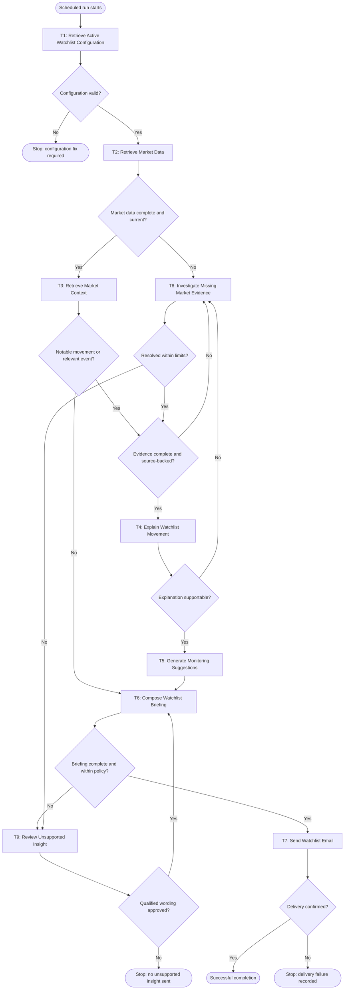

# Workflow of Tasks

## 1. Workflow Overview

### 1.1 Workflow Goal

This workflow supports the StockBrief goal in the completed [team charter](https://github.com/mbuddhal/BUS4498_Team_Build/blob/main/README.md#team-charter). For busy student investors, StockBrief keeps users informed about stocks on their watchlists with minimal daily effort by producing a short, source-backed market update, explaining possible drivers of price movement, and suggesting neutral topics to monitor without providing personalized financial advice or making trades.

### 1.2 Actors, Data, and Boundary

The scheduled workflow uses four main data areas:

1. **Watchlist Configuration Database:** stores the user's stock symbols, recipient email, active status, and market-open or market-close schedule.
2. **Market Data Sources:** provide current price, comparison price, percentage change, market status, and observation timestamp.
3. **Market Context Sources:** provide company news, earnings information, official company guidance, sector or index movement, and relevant market events.
4. **Run and Delivery Log:** records the run ID, timestamps, sources used, missing evidence, retries, review decisions, and email delivery result.

**Prerequisite outside this scheduled workflow:** Before a user can receive a briefing, the user manually enters stock symbols, a recipient email, and a market-open or market-close schedule in StockBrief. StockBrief validates those entries and saves them in its Watchlist Configuration Database. The user entry is a separate L0 setup task and the database write is a separate L1 setup task; neither task runs during every scheduled briefing.

The scheduled workflow begins only after that setup has succeeded. It does not create a watchlist, silently replace symbols, or invent a recipient.

### 1.3 Workflow Trigger

One scheduled run starts at the configured market-open or market-close time for one active watchlist record already stored in the Watchlist Configuration Database. The scheduler creates a unique run ID and passes the active watchlist record to T1.

### 1.4 Completion Conditions

The run completes successfully only when a watchlist-specific email containing the following items is sent to the recipient stored in the watchlist record:

- current price changes and observation timestamps;
- relevant market context and source links;
- clearly labeled possible explanations for notable movement;
- neutral monitoring suggestions; and
- limitations or unavailable evidence when applicable.

If the configuration is invalid, evidence cannot be resolved, a qualified explanation is rejected, or delivery fails, the workflow records the outcome and stops without claiming successful completion.

### 1.5 Tasks and Automation Levels

The workflow and automation worksheet use the same nine runtime tasks:

| ID | Task name | Level | What the task does |
|---|---|---|---|
| T1 | Retrieve Active Watchlist Configuration | L1 | Reads and validates one active saved watchlist record. |
| T2 | Retrieve Market Data | L1 | Retrieves current market values and timestamps for every symbol. |
| T3 | Retrieve Market Context | L1 | Retrieves source-backed news, earnings, sector, index, and event context. |
| T4 | Explain Watchlist Movement | L2 | Compares movement with evidence and writes possible, qualified explanations. |
| T5 | Generate Monitoring Suggestions | L2 | Produces neutral topics or signals for the user to monitor. |
| T6 | Compose Watchlist Briefing | L2 | Combines results, citations, timestamps, and limitations into the briefing. |
| T7 | Send Watchlist Email | L1 | Sends the briefing to the saved recipient and records delivery. |
| T8 | Investigate Missing Market Evidence | L3 | Handles unresolved evidence gaps through bounded, evidence-based investigation. |
| T9 | Review Unsupported Insight | L0 | Requests a human decision when the system cannot safely qualify an insight. |

L0 is used only for the human decision on the exception path. The normal scheduled path is automated; the user does not manually approve every daily briefing.

### 1.6 Normal Workflow and Control Checks

#### T1 — Retrieve Active Watchlist Configuration (L1)

T1 reads one record using the scheduled run ID. The record must contain:

- at least one valid stock symbol;
- a valid recipient email;
- an active status; and
- a valid market-open or market-close schedule.

T1 also checks that the record is not duplicated, expired, or internally inconsistent. If the record is missing, inactive, malformed, or missing a recipient, the workflow goes to **Stop: configuration fix required**. It does not query market sources or send an email.

#### T2 — Retrieve Market Data (L1)

T2 processes every symbol in the validated watchlist. For each symbol, it requests the current price, comparison price, percentage change, market status, currency when available, and observation timestamp. The run log records the source and whether the result is current enough for the configured run.

If a source is unavailable, returns an invalid value, or produces stale data, T2 records the exact missing field and routes the run to T8 instead of filling the gap with an estimate.

#### T3 — Retrieve Market Context (L1)

T3 searches approved context sources for information related to each notable movement. Relevant context may include company news, earnings information, official guidance, sector or index movement, and broad market events. Each evidence item must include a source, publication or observation time, and the symbol or market factor it relates to.

T3 does not treat a search result as proof of causation. A headline can be relevant context without proving that it caused the price movement. If no notable movement or relevant event exists, the briefing can say so and continue to T6.

#### T4 — Explain Watchlist Movement (L2)

T4 compares T2's movement with T3's evidence. It may write a possible driver only when the relationship is reasonably supported by the available evidence. Explanations must use wording such as **possible driver**, **consistent with**, or **no verified cause found** unless an authoritative source directly confirms the fact.

T4 must include the relevant symbol, time window, evidence link, and limitation. It cannot claim certainty from timing alone and cannot provide a buy, sell, or hold recommendation. If the explanation is not supportable, the run returns to T8.

#### T5 — Generate Monitoring Suggestions (L2)

T5 turns the available evidence into neutral monitoring topics. Examples include monitoring a scheduled earnings release, checking updated official company guidance, watching whether sector performance continues, or checking whether a market-wide event persists.

Suggestions describe what information to watch and why it may matter. They do not direct the user to buy, sell, or hold a security, predict a guaranteed price, or present a personalized investment decision.

#### T6 — Compose Watchlist Briefing (L2)

T6 creates the final message with a consistent section for each symbol:

1. observed price movement and timestamp;
2. relevant market context with source links;
3. possible explanation or an explicit statement that no verified cause was found;
4. neutral monitoring suggestions; and
5. evidence limitations or missing-data notes.

T6 checks that unsupported causal claims, missing citations, and prohibited trade language are not presented as final content. If the briefing is not complete or within policy, it routes to T9 for human review rather than sending it.

#### T7 — Send Watchlist Email (L1)

T7 sends the completed briefing only to the recipient stored in the validated watchlist record. It records the send time, run ID, recipient, message status, and provider response. A successful API call is not treated as delivery confirmation unless the provider returns a usable delivery status.

If delivery fails or the result is unknown, the workflow goes to **Stop: delivery failure recorded**. It does not silently report success or send to an unverified address.

### 1.7 Exception Workflow and Human Handoff

#### T8 — Investigate Missing Market Evidence (L3)

T8 runs only when T2, T3, T4, or T6 identifies missing, inconsistent, stale, unavailable, or unsupported evidence. T8 first identifies the exact gap, then chooses one permitted next action:

- retry an allowed source within the retry limit;
- narrow a market-context query;
- check an approved alternate context source;
- compare timestamps and symbol mappings; or
- escalate the unresolved gap to T9.

T8 is L3 because the next action depends on the specific failure and the available evidence. The system must inspect the situation and select among permitted investigation paths; it cannot blindly continue. T8 has bounded time, retry, and tool-call limits. It cannot invent data, convert a headline into proof, assert an unverified cause, recommend a trade, or send an email.

If T8 resolves the evidence gap, the workflow repeats the appropriate control check and continues to T4, T5, or T6. If the gap remains unresolved within limits, the case moves to T9.

#### T9 — Review Unsupported Insight (L0)

T9 is the final human-review exception. The reviewer receives the run ID, available market data, source links, missing fields, attempted investigations, and proposed wording. The reviewer may:

- approve a clearly qualified statement, which returns the run to T6 for composition; or
- reject the unsupported insight, which stops the run without sending a briefing that overstates the evidence.

The reviewer is not approving a trade recommendation. The decision is only whether the available wording is sufficiently limited and transparent to include in the briefing.

### 1.8 Workflow Diagram

### 1.9 End States and Records

The workflow has four explicit end states:

- **Successful completion:** the briefing was sent and delivery was confirmed.
- **Configuration stop:** the watchlist record must be fixed before another scheduled run.
- **Delivery stop:** the briefing could not be confirmed as delivered and the delivery failure was recorded.
- **Evidence or review stop:** the workflow could not support a qualified insight, so it stopped without sending unsupported information.

Every end state is written to the Run and Delivery Log with the run ID, timestamps, task reached, sources attempted, decision outcome, and reason for stopping.
